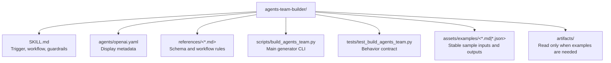

# CLAUDE.md

Breadcrumbs: [Repository Root](../CLAUDE.md) / agents-team-builder / CLAUDE.md

## Purpose

`agents-team-builder` is a workflow-aware, **multi-target** generator that turns a project brief into structured agent-team planning artifacts. It can target Codex (`~/.codex/agents/*.toml`), Claude Code (`~/.claude/agents/*.md` plus a paste-in agent-team brief), or both.

It is one of the strongest onboarding examples in this repository because it combines:

- a clear `SKILL.md`,
- UI metadata,
- focused references,
- a non-trivial Python generator,
- tests,
- example assets,
- and generated example artifacts.

## Module Map

## Entry Points

Read files in this order:

1. `SKILL.md`
2. `references/workflow-profiles.md`
3. `references/team-schema.md`
4. `scripts/build_agents_team.py`
5. `tests/test_build_agents_team.py`
6. `assets/examples/`

## Main Interface

The script-backed CLI lives in `scripts/build_agents_team.py`.

Primary inputs:

- `--input`
- `--output-dir`
- `--project-name`

Target selection:

- `--target` — `codex` (default), `claude-code`, or `both`

Optional context inputs:

- `--config-file`
- `--agents-dir`
- `--agents-md`

Explicit output paths:

- `--json-out`
- `--markdown-out`

Workflow shaping:

- `--workflow-profile`
- supported profiles include `auto`, `generic`, `superpowers-plan`, `openspec-core`, and `openspec-expanded`

Install lifecycle:

- `--install`
- `--uninstall`
- `--manifest`
- `--codex-home` (defaults to `~/.codex`)
- `--claude-home` (defaults to `~/.claude`)

## Output Contract

The generator emits structured artifacts rather than loose prose:

- one Markdown report
- one JSON document
- one `.toml` draft per generated agent role (when target includes `codex`)
- one `.md` Claude Code subagent draft per generated agent role (when target includes `claude-code`)
- one paste-in **team brief** (`<project>-claude-team-brief.md`) when target includes `claude-code`
- optional per-target install records when install mode is used

The JSON and Markdown schema is described in `references/team-schema.md`. Claude Code-specific concerns (frontmatter fields, agent-team semantics, why team configs are not pre-authored) are in `references/claude-code-subagents-notes.md`.

## Behavioral Notes

- The generator is heuristic-driven, not a full dependency analyzer.
- Workflow awareness is part of the contract, especially for `superpowers` and OpenSpec-style flows.
- Target awareness is part of the contract: the same task graph maps onto Codex `.toml` drafts, Claude Code `.md` subagents, or both. The Claude Code path emits an extra paste-in agent-team brief because Claude Code team configs (`~/.claude/teams/<team>/config.json`) are runtime state and must not be pre-authored.
- The install path is optional and should be treated as a managed lifecycle with manifests, not ad hoc file copying. With `--target both`, each platform gets its own manifest under `<home>/agents/.agents-team-builder/manifests/`.
- `artifacts/` is example evidence, not the canonical implementation surface.

## Dependencies And Test Shape

- Implementation uses Python standard library only.
- Tests focus on deterministic behavior:
  - task extraction
  - parallel grouping
  - TOML draft rendering
  - workflow-profile detection
  - install and uninstall behavior

## When To Read This Module

Read this module when you need examples of:

- script-backed skill authoring
- workflow-aware structured outputs
- machine-readable artifact contracts
- install and uninstall manifest behavior
- mixing `SKILL.md`, references, assets, and tests in one skill package

## Related Guides

- Design history: [../docs/superpowers/CLAUDE.md](../docs/superpowers/CLAUDE.md)
- Repo indexing utility: [../codebase-indexing-assistant/CLAUDE.md](../codebase-indexing-assistant/CLAUDE.md)
- Guarded audit utility: [../guarded-component-i18n-fix/CLAUDE.md](../guarded-component-i18n-fix/CLAUDE.md)
