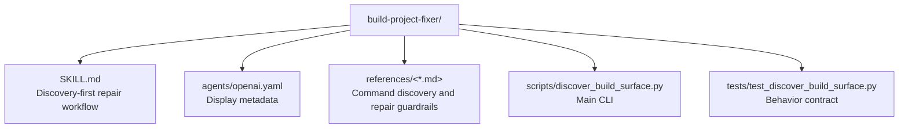

# CLAUDE.md

Breadcrumbs: [Repository Root](../CLAUDE.md) / build-project-fixer / CLAUDE.md

## Purpose

`build-project-fixer` helps an agent discover a repository's real install, build, test, lint, typecheck, and verify commands before attempting repairs.

This module is useful for onboarding because it captures a strong repository discipline: discover command truth first, then reproduce the smallest failure, then widen verification carefully.

## Module Map

## Entry Points

Read files in this order:

1. `SKILL.md`
2. `references/command-discovery.md`
3. `references/repair-guardrails.md`
4. `references/verification-policy.md`
5. `scripts/discover_build_surface.py`
6. `tests/test_discover_build_surface.py`

## Main Interface

The CLI surface is in `scripts/discover_build_surface.py`.

Primary inputs:

- `--project-root`
- `--category`
- `--json`

Supported categories:

- `install`
- `build`
- `test`
- `lint`
- `typecheck`
- `verify`
- `all`

## What The Script Reads

The discovery logic looks for common build-surface signals such as:

- `package.json`
- lockfiles like `pnpm-lock.yaml`, `package-lock.json`, `yarn.lock`, `bun.lock*`
- `pyproject.toml`
- Python lockfiles like `uv.lock` and `poetry.lock`
- Makefiles
- CI workflow commands

It then classifies command candidates and ranks them by source strength.

## Important Constraints

- The module recommends commands; it does not prove they work unless they are actually run.
- The module is designed to prevent speculative repair work.
- Repository-specific commands should win over generic ecosystem guesses when evidence exists.
- Monorepo or workspace signals should trigger scope caution.

## Dependencies And Test Shape

- Implementation uses Python standard library plus `tomllib`.
- Tests validate command detection and prioritization behavior.
- This is a discovery tool, not a build executor.

## When To Read This Module

Read this module when you need examples of:

- manifest-driven command discovery
- repair guardrail documentation
- categorized CLI output for developer workflows
- turning repo metadata into actionable command suggestions

## Related Guides

- Design history: [../docs/superpowers/CLAUDE.md](../docs/superpowers/CLAUDE.md)
- Repo indexing utility: [../codebase-indexing-assistant/CLAUDE.md](../codebase-indexing-assistant/CLAUDE.md)
- Guarded analysis utility: [../guarded-component-i18n-fix/CLAUDE.md](../guarded-component-i18n-fix/CLAUDE.md)
