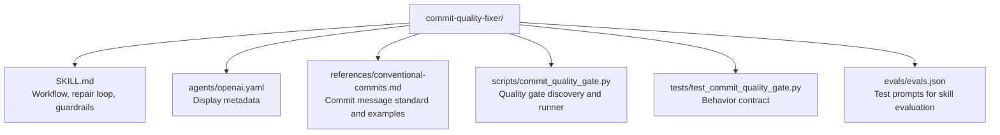

# CLAUDE.md

Breadcrumbs: [Repository Root](../CLAUDE.md) / commit-quality-fixer / CLAUDE.md

## Purpose

`commit-quality-fixer` guides a reliable commit workflow: discover quality gates, fix failures, draft a clean Conventional Commit message, and only commit once all checks pass.

This module is a strong example of a script-backed developer workflow skill. It combines a clear `SKILL.md`, a practical quality-gate discovery script, Conventional Commit reference material, and tests that validate detection behavior across Python, Node.js, Rust, Go, JVM, and .NET projects.

## Module Map

## Entry Points

Read files in this order:

1. `SKILL.md`
2. `references/conventional-commits.md`
3. `scripts/commit_quality_gate.py`
4. `tests/test_commit_quality_gate.py`
5. `evals/evals.json`

## Main Interface

The CLI surface is in `scripts/commit_quality_gate.py`.

Primary inputs:

- `--project-root`
- `--discover-only`
- `--json`
- `--fail-fast`

Output control:

- `--max-output-chars`

## What The Script Reads

The discovery logic looks for common project signals and maps them to appropriate quality checks:

- `.pre-commit-config.yaml` → `pre-commit run --all-files`
- `package.json` scripts → `lint`, `typecheck`, `test`, `build`, `check`, `ci`, `validate`, `verify`, `format:check`, `precommit`, `pre-commit`, `qa`, `quality`
- `pyproject.toml` / `setup.py` / `setup.cfg` / `requirements*.txt` → `ruff check`, `pytest`, `mypy`, `pyright`
- `Cargo.toml` → `cargo fmt --check`, `cargo clippy`, `cargo test`
- `go.mod` → `go test ./...`, `go vet ./...`
- `gradlew` / `mvnw` → Gradle `check` or Maven `verify`
- `*.sln` / `*.csproj` → `dotnet build`, `dotnet test`
- Fallback (git repo) → `git diff --check`

Package manager detection (for Node.js scripts):

- `pnpm-lock.yaml` → `pnpm`
- `yarn.lock` → `yarn`
- `bun.lockb` / `bun.lock` → `bun`
- Default → `npm`

Python runner detection:

- `uv.lock` / `[tool.uv` → `uv run`
- `poetry.lock` / `[tool.poetry` → `poetry run`
- `Pipfile` → `pipenv run`
- Default → direct invocation

## Important Constraints

- The module recommends commands based on file presence; it does not prove they work unless they are actually run.
- Repository-specific checks (pre-commit hooks, package scripts) take priority over generic ecosystem guesses.
- The repair loop in `SKILL.md` expects human judgment for root-cause analysis, not automated fixing.
- The script truncates long output streams to stay within token limits.

## Dependencies And Test Shape

- Implementation uses Python standard library only.
- Tests validate command detection, prioritization, truncation, and CLI behavior.
- This is a discovery and runner tool, not a fixer — repairs are directed by the agent using the skill.

## When To Read This Module

Read this module when you need examples of:

- multi-ecosystem quality gate discovery
- Conventional Commit standard enforcement
- script-backed developer workflow skills
- commit-time guardrails and safe repair loops
- mapping project metadata to actionable command suggestions

## Related Guides

- Design history: [../docs/superpowers/CLAUDE.md](../docs/superpowers/CLAUDE.md)
- Build and verification discovery: [../build-project-fixer/CLAUDE.md](../build-project-fixer/CLAUDE.md)
- Repo indexing utility: [../codebase-indexing-assistant/CLAUDE.md](../codebase-indexing-assistant/CLAUDE.md)
