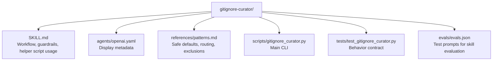

# CLAUDE.md

Breadcrumbs: [Repository Root](../CLAUDE.md) / gitignore-curator / CLAUDE.md

## Purpose

`gitignore-curator` helps an agent inspect a repository or workspace, understand what generated and local-only artifacts are present, and add safe ignore rules with clear evidence.

This module is useful for onboarding because it captures a strong discipline: analyze before editing, explain before applying, and never hide tracked content. It works for both git repositories and plain workspaces.

## Module Map

## Entry Points

Read files in this order:

1. `SKILL.md`
2. `references/patterns.md`
3. `scripts/gitignore_curator.py`
4. `tests/test_gitignore_curator.py`
5. `evals/evals.json`

## Main Interface

The CLI surface is in `scripts/gitignore_curator.py`.

Primary inputs:

- `--project-root`
- `--json`
- `--apply`

## What The Script Reads

The detection logic looks for common stack signals and maps them to appropriate ignore rules:

- `package.json` → `node_modules/`, `.next/`, `.nuxt/`, `.svelte-kit/`
- `Cargo.toml` → `target/`
- `Dockerfile` → `.git/` in `.dockerignore`
- `pyproject.toml` / `setup.py` → `.venv/`, `venv/`, `__pycache__/`
- Observed directories → `.idea/`, `.vs/`, `.gradle/`, `.terraform/`
- Local env files → `.env`, `.env.local`, `.env.*.local`
- Scratch directories → `_tmp*/`, `.uv-cache*/`, `.tmp-tests/`, `tmp/`

It then classifies candidate rules by confidence, checks for tracked-file conflicts, and routes them to the appropriate target ignore file.

## Important Constraints

- The module proposes rules; it does not apply them unless `--apply` is passed.
- Tracked-file conflicts are surfaced for human review, never auto-resolved.
- Non-git workspaces route everything to `.gitignore` since `.git/info/exclude` is unavailable.
- Publishing filters (`.npmignore`) are treated as higher risk than VCS ignore rules.
- Source directories, migrations, fixtures, examples, and deployment manifests are never auto-ignored.

## Dependencies And Test Shape

- Implementation uses Python standard library only.
- Tests validate stack detection, rule routing, tracked-file conflict detection, and apply mode across git repos and non-git workspaces.
- This is a curation tool, not a blunt force ignore generator — evidence and conservative judgment are core to its design.

## When To Read This Module

Read this module when you need examples of:

- stack-aware repository analysis
- safe ignore-file curation with evidence
- routing rules to the correct target file (.gitignore vs .git/info/exclude vs .dockerignore)
- conservative workspace cleanup that preserves tracked content
- script-backed developer workflow skills

## Related Guides

- Design history: [../docs/superpowers/CLAUDE.md](../docs/superpowers/CLAUDE.md)
- Build and verification discovery: [../build-project-fixer/CLAUDE.md](../build-project-fixer/CLAUDE.md)
- Repo indexing utility: [../codebase-indexing-assistant/CLAUDE.md](../codebase-indexing-assistant/CLAUDE.md)
