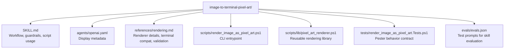

# CLAUDE.md

Breadcrumbs: [Repository Root](../CLAUDE.md) / image-to-terminal-pixel-art / CLAUDE.md

## Purpose

`image-to-terminal-pixel-art` converts local images and screenshots into terminal-friendly pixel art using ANSI truecolor half blocks or a grayscale text fallback.

This module is useful for CLI-centric workflows where opening a GUI image viewer is inconvenient or impossible: quick previews, text-only visual reviews, side-by-side image diffs, and sharing screenshots in terminal sessions or log output. It is especially handy on Windows because it uses `System.Drawing` (available by default) and does not require external tools like `chafa`, ImageMagick, or Python imaging libraries.

## Module Map

## Entry Points

Read files in this order:

1. `SKILL.md`
2. `references/rendering.md`
3. `scripts/render_image_as_pixel_art.ps1`
4. `scripts/lib/pixel_art_renderer.ps1`
5. `tests/render_image_as_pixel_art.Tests.ps1`
6. `evals/evals.json`

## Main Interface

The CLI surface is in `scripts/render_image_as_pixel_art.ps1`.

Primary parameters:

- `-Path` — source image file (required)
- `-Columns` — target output width in terminal cells (default `80`)
- `-ColorMode truecolor|none` — ANSI color or grayscale text fallback (default `truecolor`)
- `-Background` — hex color used to blend transparency (default `#000000`)
- `-AllowUpscale` — permit widening beyond the source image width

The rendering model packs two image rows into one text row by using a half-block character (`▀`) with the top pixel mapped to ANSI foreground color and the bottom pixel mapped to ANSI background color. Image height is resized to an even number so every printed cell has both a top and bottom pixel.

## What The Scripts Do

- `Convert-ImageFileToPixelArt` loads an image from disk, resizes it to the target dimensions, and returns an array of rendered text rows.
- `Convert-BitmapToPixelArt` operates on an in-memory `System.Drawing.Bitmap`, which lets callers reuse the same pipeline for images constructed programmatically or captured from the screen.
- `Get-TargetRenderSize` computes the output dimensions while enforcing even height and optional upscale constraints.
- `Resolve-PixelColor` blends transparent pixels over the configured background color before generating ANSI sequences or grayscale characters.

## Important Constraints

- This is a preview tool, not an image editor. It reads images; it never writes or modifies them.
- The main implementation path is Windows-first (PowerShell + `System.Drawing`).
- On non-Windows platforms, suggest `chafa` or `timg` as a fallback rather than attempting to run the PowerShell scripts.
- Transparent pixels are blended against the configured background color. Choose a background that matches the image's intended backdrop for accurate preview.
- Line wrapping in the terminal will distort the output. If wrapping occurs, reduce `-Columns`.
- For side-by-side comparison, render each image with the same `-Columns` value, then align the blocks manually or pipe through a diff tool.

## Dependencies And Test Shape

- Implementation uses PowerShell and the .NET `System.Drawing` assembly (available by default on Windows).
- Tests are written in Pester and validate:
  - Target render size calculations (even height enforcement)
  - ANSI half-block row generation with correct foreground/background mapping
  - Grayscale fallback output without escape sequences
  - Transparency blending over custom background colors
  - CLI wrapper end-to-end execution and missing-file error handling
- The renderer library is intentionally split from the CLI wrapper so both can be tested independently and reused by future scripts.

## When To Read This Module

Read this module when you need examples of:

- Terminal-friendly image preview without GUI dependencies
- ANSI truecolor rendering with half-block characters
- PowerShell-based image processing using `System.Drawing`
- CLI tools that gracefully degrade from color to grayscale
- Pairing screenshot capture with inline terminal display

## Related Guides

- Screenshot capture companion: [../screenshot/CLAUDE.md](../screenshot/CLAUDE.md) (if available)
- Design history: [../docs/superpowers/CLAUDE.md](../docs/superpowers/CLAUDE.md)
