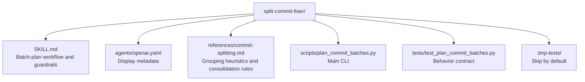

# CLAUDE.md

Breadcrumbs: [Repository Root](../CLAUDE.md) / split-commit-fixer / CLAUDE.md

## Purpose

`split-commit-fixer` helps an agent turn a large dirty git worktree into a sequence of
reviewable temporary commits, fix quality-gate failures batch by batch, and then
collapse those checkpoints into clean final history.

This module is useful for onboarding because it captures a disciplined commit workflow:
plan first, stage carefully, fix incrementally, and consolidate safely.

## Module Map

## Entry Points

Read files in this order:

1. `SKILL.md`
2. `references/commit-splitting.md`
3. `scripts/plan_commit_batches.py`
4. `tests/test_plan_commit_batches.py`

## Main Interface

The CLI surface is in `scripts/plan_commit_batches.py`.

Primary inputs:

- `--project-root`
- `--json`

## What The Script Actually Does

The script inspects a git worktree and emits a structured batch plan.

It includes logic for:

- git repository validation and dirty-state parsing
- file categorization (code, test, docs, config, asset)
- scope derivation from path tokens and workspace prefixes
- quality-gate command detection from manifests, CI, and lockfiles
- batch grouping by feature scope with coupling awareness
- Conventional Commit suggestions per batch
- post-commit consolidation planning with configurable granularity

The script supports JavaScript/TypeScript, Python, Rust, Go, and .NET ecosystems.

## Important Constraints

- The script recommends batches; it does not execute git commands.
- Each batch commit is treated as a temporary checkpoint, not the final history.
- Consolidation is non-interactive and aborts on any safety check failure.
- Partially staged files trigger cautions but are not automatically resolved.

## Dependencies And Test Shape

- Implementation uses Python standard library only.
- Tests create temporary git repositories under `.tmp-tests/`.
- Those fixture directories are generated test evidence and should be skipped during
  orientation scans.

## When To Read This Module

Read this module when you need examples of:

- git-aware batch planning
- quality-gate command detection across ecosystems
- structured commit suggestions with Conventional Commit formatting
- safe checkpoint-then-squash consolidation workflows
- mixing `SKILL.md`, references, and test-backed scripts in one skill package

## Related Guides

- Design history: [../docs/superpowers/CLAUDE.md](../docs/superpowers/CLAUDE.md)
- Build and check discovery: [../build-project-fixer/CLAUDE.md](../build-project-fixer/CLAUDE.md)
- Guarded component audit: [../guarded-component-i18n-fix/CLAUDE.md](../guarded-component-i18n-fix/CLAUDE.md)
