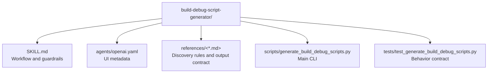

# CLAUDE.md

Breadcrumbs: [Repository Root](../CLAUDE.md) / build-debug-script-generator / CLAUDE.md

## Purpose

`build-debug-script-generator` helps an agent inspect an existing repository and generate Windows-first PowerShell wrappers for build and quick-debug flows, plus matching JSON and Markdown review artifacts.

## Module Map



## Entry Points

Read files in this order:

1. `SKILL.md`
2. `references/discovery-rules.md`
3. `references/output-contract.md`
4. `references/script-guardrails.md`
5. `scripts/generate_build_debug_scripts.py`
6. `tests/test_generate_build_debug_scripts.py`

## Main Interface

Run:

```bash
python scripts/generate_build_debug_scripts.py --project-root <repo> --output-dir <repo>/scripts
```

Primary outputs:

- `build.ps1`
- `debug.ps1`
- `build-debug-bundle.json`
- `build-debug-bundle.md`

## Important Constraints

- The helper writes scripts and reports. It does not execute project commands.
- The JSON bundle is the strongest machine-readable truth source.
- PowerShell generation is Windows-first in version one.
- Missing confidence must surface as blockers, not hidden fallbacks.

## Related Guides

- Design history: [../docs/superpowers/CLAUDE.md](../docs/superpowers/CLAUDE.md)
- Build repair discovery: [../build-project-fixer/CLAUDE.md](../build-project-fixer/CLAUDE.md)
- Local CI workflow replay: [../local-ci-fixer/CLAUDE.md](../local-ci-fixer/CLAUDE.md)
