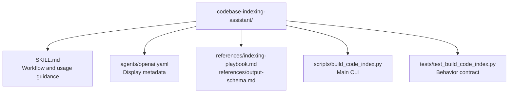

# CLAUDE.md

Breadcrumbs: [Repository Root](../CLAUDE.md) / codebase-indexing-assistant / CLAUDE.md

## Purpose

`codebase-indexing-assistant` is a lightweight repository-index generator. It is designed for first-pass orientation: build a Markdown and JSON index, then narrow manual reading based on the generated report.

This module is a strong example of a script-backed analysis skill with a small and clear contract.

## Module Map

## Entry Points

Read files in this order:

1. `SKILL.md`
2. `references/output-schema.md`
3. `references/indexing-playbook.md`
4. `scripts/build_code_index.py`
5. `tests/test_build_code_index.py`

## Main Interface

The CLI surface is in `scripts/build_code_index.py`.

Primary inputs:

- `--root`
- `--markdown-out`
- `--json-out`

Scope control:

- `--include`
- `--exclude`
- `--focus`
- `--max-files`
- `--depth`

## What The Script Actually Does

The script scans a repository and builds two outputs:

- a Markdown summary for fast reading
- a JSON index for tooling or structured inspection

The implementation includes logic for:

- common skip directories and binary suffixes
- manifest and doc detection
- heuristic command extraction
- entrypoint candidates
- reading-order suggestions
- language and import pattern hints

## Important Constraint

This module is explicitly heuristic.

Treat these fields as suggestions, not facts:

- `entry_candidates`
- `reading_order`
- inferred commands
- importance rankings

The intended workflow is:

1. run the indexer
2. read the summary
3. narrow the scope
4. inspect only the promoted files

## Dependencies And Test Shape

- Implementation uses Python standard library plus `tomllib`.
- The script is designed to be portable and does not depend on a project-specific runtime.
- Tests validate report generation behavior and schema-level expectations.

## When To Read This Module

Read this module when you need examples of:

- report-generating repository utilities
- skip-list based scanning
- heuristic repo summarization
- structured Markdown and JSON dual-output tooling

## Related Guides

- Design history: [../docs/superpowers/CLAUDE.md](../docs/superpowers/CLAUDE.md)
- Build and verification discovery: [../build-project-fixer/CLAUDE.md](../build-project-fixer/CLAUDE.md)
- Workflow-aware structured generation: [../agents-team-builder/CLAUDE.md](../agents-team-builder/CLAUDE.md)
