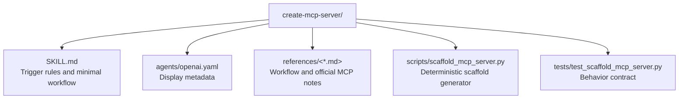

# CLAUDE.md

Breadcrumbs: [Repository Root](../CLAUDE.md) / create-mcp-server / CLAUDE.md

## Purpose

`create-mcp-server` scaffolds a minimal Model Context Protocol server. It is designed for narrow starter work: TypeScript by default, Python as an alternate path, stdio transport, and one example tool.

## Module Map



## Entry Points

Read files in this order:

1. `SKILL.md`
2. `references/scaffold-workflow.md`
3. `references/official-notes.md`
4. `scripts/scaffold_mcp_server.py`
5. `tests/test_scaffold_mcp_server.py`

## Main Interface

Run:

```bash
python scripts/scaffold_mcp_server.py --output-dir <target-dir> --stack typescript
```

Supported stacks:

- `typescript`
- `python`

Optional flag:

- `--force` to allow writing into a non-empty target directory

## Output Contract

The script creates a minimal runnable starter, not a full framework.

- TypeScript:
  - `package.json`
  - `tsconfig.json`
  - `src/index.ts`
  - `.gitignore`
  - `README-snippet.md`
- Python:
  - `pyproject.toml`
  - `server.py`
  - `.gitignore`
  - `README-snippet.md`

## Important Constraints

- Do not treat this module as a deployment or publishing workflow.
- Do not add multi-transport support by default.
- Do not overwrite non-empty directories without explicit force.
- Do not claim the scaffold is validated until local runtime or Inspector checks are run.

## Related Guides

- Design history: [../docs/superpowers/CLAUDE.md](../docs/superpowers/CLAUDE.md)
- Project context generation: [../project-ai-context-initializer/CLAUDE.md](../project-ai-context-initializer/CLAUDE.md)

## Verification Focus

The strongest implementation truth is the generator script plus the tests. The reference files explain why the defaults are narrow; the tests prove the file set and overwrite rules.
