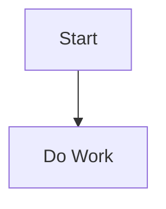
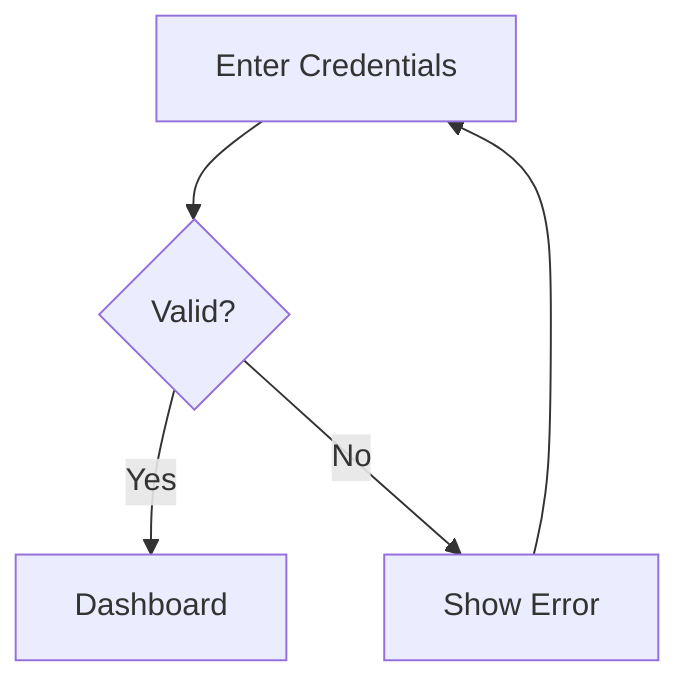
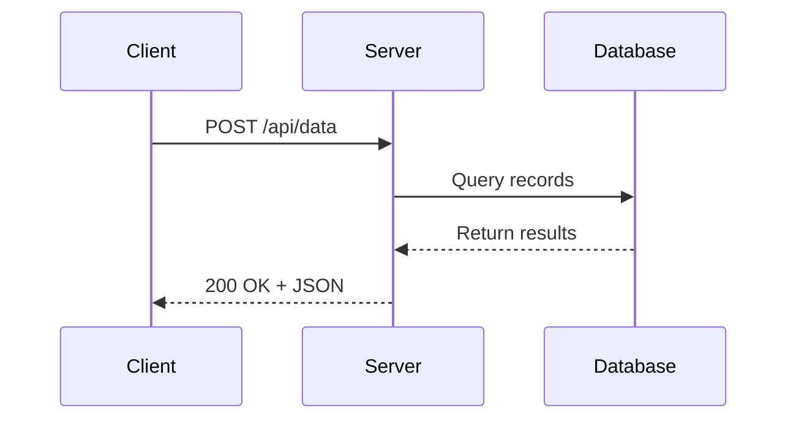

# Draw Mermaid Diagrams

## Overview

Generate valid Mermaid code quickly, with the right diagram type and clear structure.
Produce outputs that are easy to paste into Markdown, docs, or Mermaid-compatible tools.

## Adaptive Detection

Before drafting, scan the workspace to adapt output style and conventions:

1. Detect existing diagram usage:
   - Search for ` ```mermaid ` blocks in `.md` files to understand current conventions.
   - Look for existing diagram files (`.mmd`, `.mermaid`).
2. Detect documentation context:
   - Check for `README.md`, `docs/`, or `architecture/` directories.
   - Look for ADRs or design docs that may need accompanying diagrams.
3. Detect project domain:
   - Check `package.json` for web projects (favor component/flow diagrams).
   - Check `Cargo.toml` or `go.mod` for backend projects (favor architecture/sequence diagrams).

## Core Workflow

1. **Extract intent and entities.**
   Determine what must be shown: actors, states, steps, decisions, data objects, and relationships.

2. **Select the diagram type** before writing code.
   Use:
   - `flowchart` for process logic and branching.
   - `sequenceDiagram` for interactions over time.
   - `stateDiagram-v2` for state transitions.
   - `classDiagram` for object models.
   - `erDiagram` for data entities and cardinality.
   - `journey`, `gantt`, `mindmap`, or `pie` for specialized views.
   Use [Mermaid Cheat Sheet](references/mermaid-cheatsheet.md) for syntax patterns.

3. **Draft a minimal valid diagram first.**
   Start with the smallest structure that renders correctly, then add detail incrementally.
   Prefer stable IDs and short labels to reduce parse issues.

4. **Apply readability rules.**
   - Keep edge labels concise.
   - Split large graphs into subgraphs or multiple diagrams.
   - Avoid excessive crossing edges.
   - Use consistent direction (`TD` or `LR`) and naming style.

5. **Validate before returning.**
   Check for balanced brackets, valid arrows, proper keywords, and coherent node references.
   If user input is ambiguous, state assumptions explicitly and continue with a best-fit draft.

## Output Contract

- Default to fenced Markdown Mermaid output:

- Add a short "Assumptions" section only when needed.
- If asked to edit existing Mermaid, preserve original semantics and only change requested parts.
- If asked for multiple options, provide 2-3 variants with brief tradeoffs.

## Examples

### Example 1: Simple Flowchart

**Input:** "Show the user login process."

**Output:**


### Example 2: Sequence Diagram

**Input:** "Diagram the API request flow between client and server."

**Output:**


## Debugging Rules

- Reproduce and isolate the smallest failing snippet.
- Check diagram-type-specific syntax first (for example `sequenceDiagram` participants, `erDiagram` relationship forms).
- Replace suspicious labels with plain ASCII if parser errors are unclear.
- When syntax cannot be fully verified locally, mark uncertain lines and provide a conservative fallback version.

## Quality Checklist

- Diagram type matches the user goal.
- Code is syntactically plausible Mermaid.
- Node IDs are unique and reused consistently.
- Direction and naming are consistent.
- Output is copy-paste ready.
