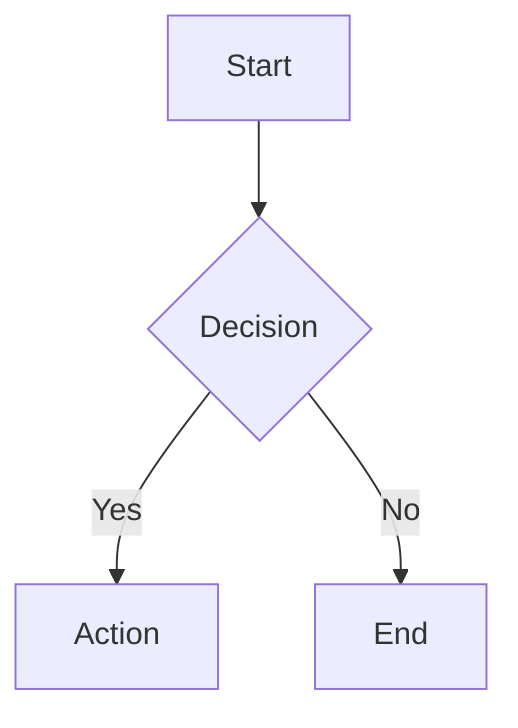
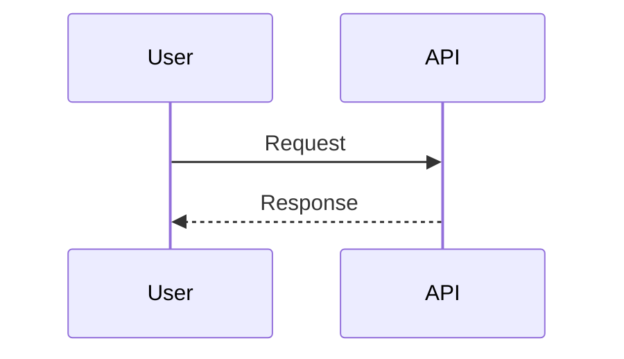
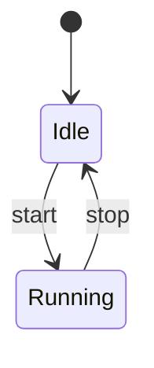
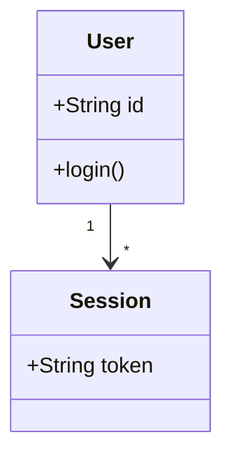
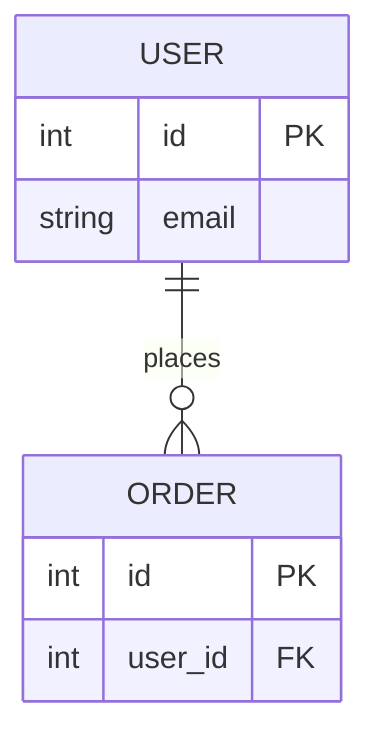

# Mermaid Cheat Sheet

## Flowchart

## Sequence Diagram

## State Diagram

## Class Diagram

## ER Diagram

## Useful Style and Layout

- Use `flowchart TD` for top-down and `flowchart LR` for left-right.
- Use `subgraph` to group related nodes.
- Keep labels short; move long explanation outside the diagram.
- Use stable IDs and readable labels:
  - Good: `AuthSvc[Auth Service]`
  - Avoid: `Node-1[Very long sentence ...]`
