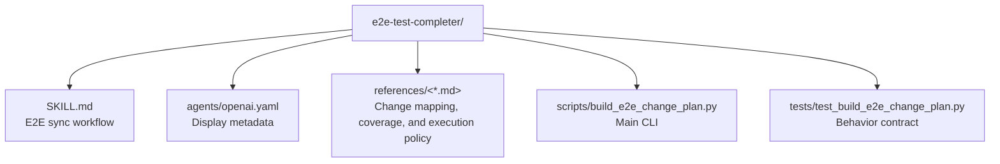

# CLAUDE.md

Breadcrumbs: [Repository Root](../CLAUDE.md) / e2e-test-completer / CLAUDE.md

## Purpose

`e2e-test-completer` helps an agent discover a repository's E2E runner surface, map recent implementation changes to affected test specs, and plan the safest verification command before running the full suite.

This module is useful when code changes may have invalidated Playwright or Cypress tests, or when coverage gaps need to be closed after new features land.

## Module Map

## Entry Points

Read files in this order:

1. `SKILL.md`
2. `references/change-mapping.md`
3. `references/coverage-playbook.md`
4. `references/execution-policy.md`
5. `scripts/build_e2e_change_plan.py`
6. `tests/test_build_e2e_change_plan.py`

## Main Interface

The CLI surface is in `scripts/build_e2e_change_plan.py`.

Primary inputs:

- `--project-root`
- `--mode` (`discover`, `plan`, `simulate`)
- `--changed-file` (repeatable)
- `--git-base`
- `--framework`
- `--json`

### Modes

| Mode | Purpose |
|------|---------|
| `discover` | Detect the E2E runner, config paths, working directory, and spec count. |
| `plan` | Rank specs against changed files and flag coverage gaps. |
| `simulate` | Build the narrowest targeted command and the full command for dry-run review. |

## What The Script Returns

The JSON payload includes:

- `runner.framework` — `playwright`, `cypress`, or `unknown`
- `runner.primary_command` — the inferred test command
- `runner.working_directory` — nested app directory when the E2E stack lives below repo root
- `spec_count` and `spec_paths`
- `change_reports` — changed files mapped to ranked spec matches with scores and reasons
- `coverage_gaps` — changed files with no matching spec
- `execution_plan.targeted_command` — narrowest useful verification command
- `execution_plan.full_command` — full suite command
- `overall_status` — `discovered`, `planned`, `simulated`, `gap`, or `blocked`

## Important Constraints

- The module recommends commands and mappings; it does not prove tests pass unless they are actually run.
- Spec ranking uses path-token and content-token heuristics — review top matches before editing.
- Generic token overlap (e.g., `page`, `modal`, `form`) can produce false positives.
- `simulate` is dry-run planning only, not a test execution.

## Dependencies And Test Shape

- Implementation uses Python standard library only.
- Tests validate runner detection, change-to-spec matching, and command building.
- This is a discovery and planning tool, not a test executor.

## When To Read This Module

Read this module when you need examples of:

- E2E runner auto-detection from config files and package scripts
- File-change to spec ranking using token heuristics
- Coverage gap triage and reporting
- Nested monorepo app working-directory handling
- Dry-run verification planning before expensive test execution

## Related Guides

- Design history: [../docs/superpowers/CLAUDE.md](../docs/superpowers/CLAUDE.md)
- Build repair utility: [../build-project-fixer/CLAUDE.md](../build-project-fixer/CLAUDE.md)
- Repo indexing utility: [../codebase-indexing-assistant/CLAUDE.md](../codebase-indexing-assistant/CLAUDE.md)
