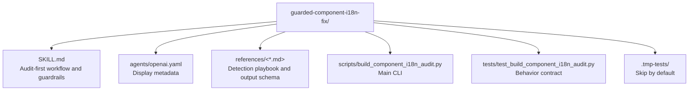

# CLAUDE.md

Breadcrumbs: [Repository Root](../CLAUDE.md) / guarded-component-i18n-fix / CLAUDE.md

## Purpose

`guarded-component-i18n-fix` is an audit-first skill for component-level internationalization work. Its core rule is simple: detect the repository's existing i18n system first, and only then plan minimal safe fixes.

This module is a strong example of conservative, safety-first analyzer design in this repository.

## Module Map

## Entry Points

Read files in this order:

1. `SKILL.md`
2. `references/output-schema.md`
3. `references/detection-playbook.md`
4. `scripts/build_component_i18n_audit.py`
5. `tests/test_build_component_i18n_audit.py`

## Main Interface

The CLI surface is in `scripts/build_component_i18n_audit.py`.

Primary inputs:

- `--root`
- `--target`

Optional output controls:

- `--markdown-out`
- `--json-out`

Scope control:

- `--max-files`

## What The Script Actually Does

The script scans a target component directory and surrounding repository signals, then emits a guarded audit.

It includes logic for:

- skip lists for generated and binary content
- package and import pattern detection
- framework scoring across multiple i18n systems
- per-file findings
- conservative safe-fix planning
- forbidden-action reporting
- blind-spot reporting

The script explicitly recognizes patterns for systems such as:

- `next-intl`
- `react-i18next`
- `react-intl`
- `vue-i18n`
- `gettext`
- custom i18n-style hooks

## Important Constraints

- Detection confidence matters.
- Low-confidence detection should block speculative changes.
- The output is designed to avoid introducing a second i18n framework.
- The safe-fix plan is intentionally conservative and should not be treated as a green light for broad rewrites.

## Dependencies And Test Shape

- Implementation uses Python standard library only.
- Tests create temporary fixture repositories under `.tmp-tests/`.
- Those fixture directories are generated test evidence and should be skipped during orientation scans.

## When To Read This Module

Read this module when you need examples of:

- audit-first automation
- multi-framework static detection
- conservative action planning
- combining report generation with explicit forbidden-action lists

## Related Guides

- Design history: [../docs/superpowers/CLAUDE.md](../docs/superpowers/CLAUDE.md)
- Workflow-aware generation: [../agents-team-builder/CLAUDE.md](../agents-team-builder/CLAUDE.md)
- Repo indexing utility: [../codebase-indexing-assistant/CLAUDE.md](../codebase-indexing-assistant/CLAUDE.md)
