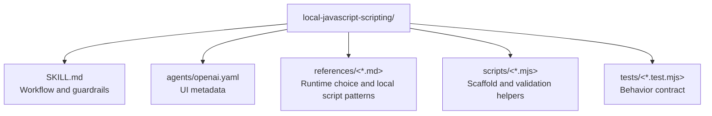

# CLAUDE.md

Breadcrumbs: [Repository Root](../CLAUDE.md) / local-javascript-scripting / CLAUDE.md

## Purpose

`local-javascript-scripting` helps an agent produce and review local Node.js automation scripts without drifting into browser or frontend patterns. It is useful when the task is file IO, CLI wrapping, child-process orchestration, or small local batch automation on the current machine.

## Module Map



## Entry Points

Read files in this order:

1. `SKILL.md`
2. `references/runtime-and-module-choice.md`
3. `references/local-script-patterns.md`
4. `scripts/scaffold-local-node-script.mjs`
5. `scripts/check-local-node-script.mjs`
6. `tests/*.test.mjs`

## Main Interfaces

Scaffold a starter:

```bash
node scripts/scaffold-local-node-script.mjs --output ./scripts/example.mjs --kind cli --module esm --name example
```

Check a supposed local script:

```bash
node scripts/check-local-node-script.mjs --json ./scripts/example.mjs
```

## Important Constraints

- This module is Node.js-first, not browser-first.
- Browser-only globals should be treated as blockers in supposed local scripts.
- The scaffold helper generates a starting point; it does not prove task correctness.
- `node --check` only proves syntax, so final usage still needs a real local invocation when behavior matters.

## Related Guides

- Design history: [../docs/superpowers/CLAUDE.md](../docs/superpowers/CLAUDE.md)
- Build-surface discovery example: [../build-project-fixer/CLAUDE.md](../build-project-fixer/CLAUDE.md)
- Project-skill generation example: [../project-skill-builder/CLAUDE.md](../project-skill-builder/CLAUDE.md)
