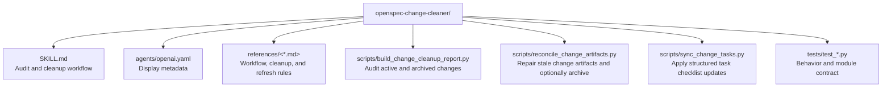

# CLAUDE.md

Breadcrumbs: [Repository Root](../CLAUDE.md) / openspec-change-cleaner / CLAUDE.md

## Purpose

`openspec-change-cleaner` is a conservative maintenance skill for OpenSpec repositories. It helps an agent audit active changes, reconcile artifacts with the latest implementation, and identify archive entries that are safe to clean without erasing meaningful history.

This module is a script-backed example of OpenSpec hygiene work: it keeps `SKILL.md` lean, moves workflow details into references, and provides deterministic helpers for reporting and checklist synchronization.

## Module Map

## Entry Points

Read files in this order:

1. `SKILL.md`
2. `references/current-workflow.md`
3. `references/cleanup-rules.md`
4. `references/artifact-refresh.md`
5. `scripts/build_change_cleanup_report.py`
6. `scripts/reconcile_change_artifacts.py`
7. `scripts/sync_change_tasks.py`
8. `tests/test_build_change_cleanup_report.py`
9. `tests/test_reconcile_change_artifacts.py`
10. `tests/test_sync_change_tasks.py`
11. `tests/test_skill_contract.py`

## Main Interface

The deterministic script surfaces are:

- `python scripts/build_change_cleanup_report.py --repo-root <repo-root> [--change <id>] [--skip-archive] [--json-out <path>] [--markdown-out <path>]`
- `python scripts/reconcile_change_artifacts.py --repo-root <repo-root> [--change <id>] [--archive-when-ready] [--json-out <path>] [--markdown-out <path>]`
- `python scripts/sync_change_tasks.py --tasks-file <tasks.md> --update-file <task-updates.json> [--write-in-place | --output-file <path>]`

Primary inputs:

- `--repo-root`
- `--change`
- `--skip-archive`
- `--archive-when-ready`
- `--json-out`
- `--markdown-out`
- `--tasks-file`
- `--update-file`

## Output Contract

This module should produce or describe:

- a JSON cleanup report for active changes and archive entries
- a Markdown cleanup report that summarizes repair, archive, and review candidates
- a JSON and Markdown reconciliation report for repaired, blocked, validated, and archived changes
- deterministic regeneration of `proposal.md`, `design.md`, `specs/**/spec.md`, and `tasks.md` for stale active changes
- deterministic `tasks.md` updates from a structured JSON payload
- a conservative classification model:
  - `repair-artifacts`
  - `active-work`
  - `ready-for-verify-or-archive`
  - `safe-cleanup-candidate`
  - `keep-history`
  - `review`

## Important Constraints

- The report helper does not prove implementation correctness by itself; the agent still has to inspect the latest implementation.
- Archive history is preserved by default. Cleanup recommendations should stay conservative and explicit.
- Auto-archive is optional and only runs after the repaired change becomes complete and validates cleanly.
- `tasks.md` synchronization is mechanical only; semantic task truth still comes from the agent's repo inspection.
- The module is designed around OpenSpec 1.2.0 CLI surfaces verified in this environment.

## Related Guides

- Design history: [../docs/superpowers/CLAUDE.md](../docs/superpowers/CLAUDE.md)
- Workflow-aware OpenSpec generation: [../agents-team-builder/CLAUDE.md](../agents-team-builder/CLAUDE.md)
- Build and verification discovery: [../build-project-fixer/CLAUDE.md](../build-project-fixer/CLAUDE.md)
- Large transformation preparation: [../spec-driven-develop/CLAUDE.md](../spec-driven-develop/CLAUDE.md)
