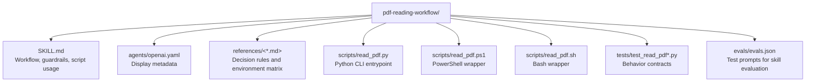

# CLAUDE.md

Breadcrumbs: [Repository Root](../CLAUDE.md) / pdf-reading-workflow / CLAUDE.md

## Purpose

`pdf-reading-workflow` gives an agent a reliable, backend-agnostic path for understanding
PDF files: probing the environment, inspecting metadata, extracting text from born-digital
documents, and rendering scanned pages to images when text extraction fails.

This module is useful whenever a PDF appears in the task and you need to know what is
inside it — whether that means reading paragraphs, checking bookmarks, or preparing page
images for OCR or vision models.

## Module Map

## Entry Points

Read files in this order:

1. `SKILL.md`
2. `references/reading-playbook.md`
3. `references/environment-matrix.md`
4. `scripts/read_pdf.py`
5. `scripts/read_pdf.ps1` (if on Windows)
6. `scripts/read_pdf.sh` (if on macOS/Linux)
7. `tests/test_read_pdf.py`
8. `evals/evals.json`

## Main Interface

The CLI surface is in `scripts/read_pdf.py`. The shell and PowerShell wrappers delegate
to it when Python is available, or to Poppler CLI tools when it is not.

Primary commands:

- `probe` — discover available backends
- `inspect` — page count, metadata, outline/bookmarks
- `text` — extract text from born-digital PDFs
- `render` — convert pages to PNG images

Common options:

- `--pages 1-3,7`
- `--max-chars 8000`
- `--output artifacts/doc.txt`
- `--output-dir artifacts/doc-pages`
- `--dpi 144`
- `--json`

## What The Scripts Do

- `probe` checks for `pymupdf`, `pypdf`, `pdfinfo`, `pdftotext`, and `pdftoppm`, then
  reports which backend is preferred for each capability.
- `inspect` returns page count, metadata dictionary, and table-of-contents entries.
- `text` extracts per-page text and can emit either combined plain text or structured
  JSON.
- `render` converts select pages to images using the best available backend.

The wrappers (`read_pdf.ps1` and `read_pdf.sh`) handle environment detection:
prefer `uv run` when available, fall back to local `python3`/`python`, and surface
helpful error messages when nothing works.

## Important Constraints

- This skill reads PDFs; it does not edit, merge, fill forms, or unlock password-protected
  files.
- OCR is intentionally out of scope. Render pages and hand them to an OCR or vision tool
  when needed.
- `text` extraction may lose layout. Do not promise page-perfect reconstruction unless
  the backend already provides it.
- Rendered images are one file per page so downstream steps can inspect only the pages
  they need.

## Dependencies And Test Shape

- `read_pdf.py` tries `pymupdf` first, then `pypdf`, then Poppler CLI fallbacks.
- Tests validate probing, inspection, text extraction, and rendering behavior for each
  backend path.
- The wrappers are tested separately to ensure they correctly locate Python and forward
  arguments.

## When To Read This Module

Read this module when you need examples of:

- Multi-backend CLI design with graceful fallback
- Platform-specific wrappers (PowerShell, bash) around a Python core
- Probing an environment before attempting file operations
- Switching between text extraction and image rendering based on file content

## Related Guides

- Design history: [../docs/superpowers/CLAUDE.md](../docs/superpowers/CLAUDE.md)
