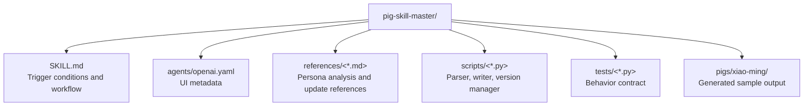

# CLAUDE.md

Breadcrumbs: [Repository Root](../AGENTS.md) / pig-skill-master / CLAUDE.md

## Purpose

`pig-skill-master/` turns QQ group chat evidence plus user impressions into reusable friend-persona skills, then supports additive updates, correction-driven tuning, version snapshots, and rollback.

## Module Map

## Read Order

1. `SKILL.md`
2. `references/intake.md`
3. `references/persona-analyzer.md`
4. `references/persona-builder.md`
5. `references/merger.md`
6. `references/correction-handler.md`
7. `scripts/qq_chat_parser.py`
8. `scripts/group_batch_builder.py`
9. `scripts/skill_writer.py`
10. `scripts/version_manager.py`
10. `tests/`

## Output Contract

One generated friend skill should produce:

- `pigs/<slug>/persona.md`
- `pigs/<slug>/meta.json`
- `pigs/<slug>/SKILL.md`
- `pigs/<slug>/persona-skill.md`
- `pigs/<slug>/versions/`
- `pigs/<slug>/knowledge/messages/`

## Important Constraints

- Treat `persona.md` as the canonical source and regenerate companion skill files from it.
- Keep raw evidence under `knowledge/messages/` or user-provided inputs; do not blend raw messages into the generated frontmatter.
- Preserve version history before mutating an existing friend skill.
- When renaming generated slugs, back up the current version first and regenerate `SKILL.md` plus `persona-skill.md` from the canonical `persona.md`.
- Use standard skill frontmatter in both the root skill and generated friend skills.
- Distinguish observed chat evidence from hand-authored interpretation.

## Related Files

- Public overview: `README.md`
- English overview: `README_EN.md`
- Installation notes: `INSTALL.md`
