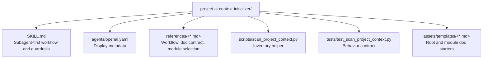

# CLAUDE.md

Breadcrumbs: [Repository Root](../CLAUDE.md) / project-ai-context-initializer / CLAUDE.md

## Purpose

`project-ai-context-initializer` initializes or refreshes repository-facing AI context docs. It is designed for tasks that need a root `AGENTS.md`, a fallback `CLAUDE.md`, selected module-level `CLAUDE.md` files, Mermaid navigation maps, and an honest coverage report.

## Module Map

## Entry Points

Read files in this order:

1. `SKILL.md`
2. `references/workflow.md`
3. `references/doc-contract.md`
4. `references/module-selection.md`
5. `scripts/scan_project_context.py`
6. `tests/test_scan_project_context.py`
7. `assets/templates/`

## Main Interface

The workflow is intentionally subagent-first:

1. dispatch a datetime subagent
2. dispatch an initialization architect subagent
3. integrate root and module docs locally
4. print an honest coverage summary in the main chat

The local helper script exists to make the first inventory deterministic, not to replace targeted reads.

## Output Contract

The skill expects these outputs:

- root `AGENTS.md`
- root `CLAUDE.md`
- a small set of module-level `CLAUDE.md` files
- Mermaid structure diagrams
- breadcrumb navigation
- a summary that reports scanned, covered, and skipped areas

## Important Constraints

- Prefer incremental updates over blind rewrites.
- Do not document every directory in a large repo; prioritize navigation value.
- Skip vendor, cache, temp, and generated areas unless they matter to the user's question.
- Keep the summary honest about coverage and skipped reasons.

## Related Guides

- Root orientation: [../AGENTS.md](../AGENTS.md)
- Design history: [../docs/superpowers/CLAUDE.md](../docs/superpowers/CLAUDE.md)
- Repo indexing patterns: [../codebase-indexing-assistant/CLAUDE.md](../codebase-indexing-assistant/CLAUDE.md)
