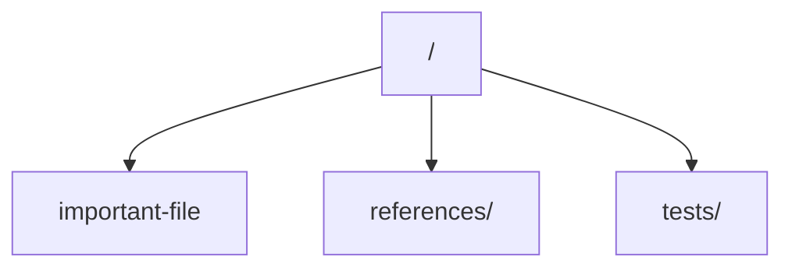

# <Module Name>

Breadcrumbs: `repo/` -> `<module>`

## Purpose

Explain what this module owns and why it matters.

## Structure

## Read Order

1. `important-file`
2. `references/...`
3. `tests/...`

## Notes

- Mention common misunderstandings.
- Mention nearby modules worth reading next.
