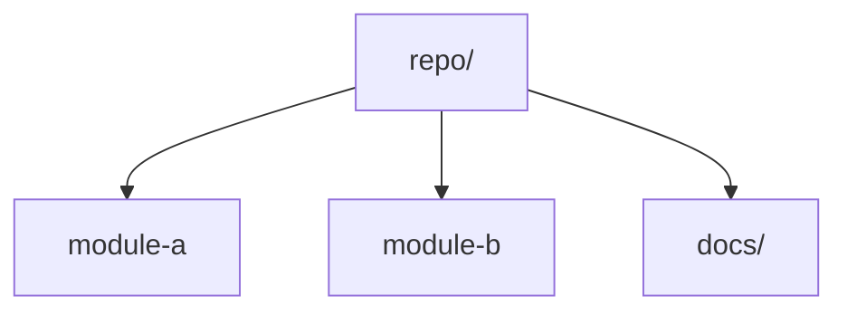

# <Repository Name>

## Purpose

One paragraph explaining what the repository is, what it produces, and how a new agent should orient itself.

## Navigation

- Read this file first.
- Then open the most relevant module-level `CLAUDE.md`.
- Use sibling module docs as examples, not as blanket rules.

## Module Map

## High-Value Modules

- `module-a/`
- `module-b/`
- `docs/`

## Coverage

- Scanned: X / Y
- Coverage: X%
- Skipped: temp, cache, generated outputs

## Next Scans

- `another-module/`
