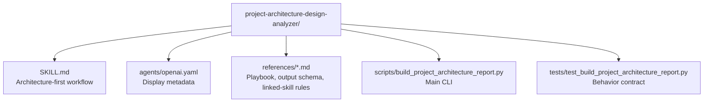

# CLAUDE.md

Breadcrumbs: [Repository Root](../CLAUDE.md) / project-architecture-design-analyzer / CLAUDE.md

## Purpose

`project-architecture-design-analyzer` produces a quick, evidence-backed snapshot of a repository's
architecture and design. It is meant to run first on any unfamiliar codebase so that later work
— refactoring, documentation, onboarding, or skill generation — starts from structure rather than
guessing.

This module is a good example of a script-backed analysis skill with a clean contract: scan,
summarize, then recommend the next skill.

## Module Map

## Entry Points

Read files in this order:

1. `SKILL.md`
2. `references/analysis-playbook.md`
3. `references/output-schema.md`
4. `references/linked-skills.md`
5. `scripts/build_project_architecture_report.py`
6. `tests/test_build_project_architecture_report.py`

## Main Interface

The CLI surface is in `scripts/build_project_architecture_report.py`.

Primary inputs:

- `--root` — repository root to analyze
- `--markdown-out` — explicit path for Markdown report
- `--json-out` — explicit path for JSON report

Scope control:

- `--focus` — bias findings toward a subsystem or keyword
- `--include` — restrict scanning to matching path prefixes
- `--exclude` — skip matching path prefixes
- `--max-files` — cap the number of files scanned
- `--depth` — directory-summary depth

## What the Script Actually Does

The script scans a repository and produces two outputs:

- a Markdown report for fast human reading
- a JSON payload for structured inspection or downstream tooling

The implementation covers:

- common skip directories and binary suffixes
- manifest and documentation detection
- heuristic command extraction from package scripts, Makefiles, and manifest files
- entrypoint candidate scoring
- language and import pattern extraction
- cross-directory boundary detection
- design-pattern inference (layered, component/service split, documentation-driven, multi-package)
- drift-risk heuristics (missing docs, thin tests, mixed runtimes, undocumented coupling)
- linked-skill recommendations based on scan signals
- suggested next reads

## Important Constraints

This module is explicitly heuristic.

Treat these fields as informed suggestions, not facts:

- `entry_candidates`
- `design_patterns`
- `drift_risks`
- inferred commands
- linked-skill recommendations

The intended workflow is:

1. run the analyzer
2. read the summary and architecture shape
3. narrow the scope based on findings
4. inspect only the promoted files, or hand off to a more specialized skill

## Dependencies and Test Shape

- Implementation uses Python standard library plus `tomllib`.
- The script is portable and does not depend on a project-specific runtime.
- Tests validate report generation, schema expectations, filtering, and edge cases such as UTF-8
  BOM handling.

## When to Read This Module

Read this module when you need examples of:

- architecture-first repository analysis
- heuristic design-pattern detection
- drift-risk prompting
- linked-skill routing based on scan signals
- structured Markdown and JSON dual-output tooling

## Related Guides

- Design history: [../docs/superpowers/CLAUDE.md](../docs/superpowers/CLAUDE.md)
- Broader repo indexing: [../codebase-indexing-assistant/CLAUDE.md](../codebase-indexing-assistant/CLAUDE.md)
- Build and verification discovery: [../build-project-fixer/CLAUDE.md](../build-project-fixer/CLAUDE.md)
- Feature flow tracing: [../feature-call-chain-mapper/CLAUDE.md](../feature-call-chain-mapper/CLAUDE.md)
