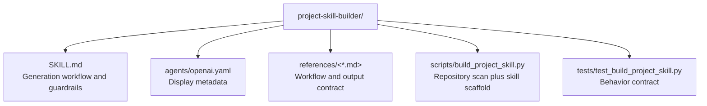

# CLAUDE.md

Breadcrumbs: [Repository Root](../CLAUDE.md) / project-skill-builder / CLAUDE.md

## Purpose

`project-skill-builder` turns a concrete repository scan into a reusable skill package. It is useful when onboarding into a project repeatedly costs too much context and a repo-specific skill would let future sessions start from local truth instead of generic assumptions.

## Module Map

## Entry Points

Read files in this order:

1. `SKILL.md`
2. `references/scaffolding-workflow.md`
3. `references/generated-skill-contract.md`
4. `scripts/build_project_skill.py`
5. `tests/test_build_project_skill.py`

## Main Interface

The script is the deterministic entry surface:

- `--project-root`
- `--skill-name`
- `--output-dir`
- `--include`
- `--exclude`
- `--max-files`
- `--force`

## Output Contract

The script creates a generated skill package containing:

- `SKILL.md`
- `CLAUDE.md`
- `agents/openai.yaml`
- `references/project-map.md`
- `references/working-rules.md`
- `artifacts/project-analysis.json`

## Important Constraints

- Commands are hints until separately executed.
- Entrypoints and reading order are heuristics, not proof.
- Generated skills should preserve repository-specific language and boundaries rather than flattening every repo into the same template.
- Skip vendor, cache, temp, and generated areas by default.
- Do not overwrite an existing generated package unless `--force` is explicit.

## Related Guides

- Repo orientation: [../AGENTS.md](../AGENTS.md)
- Design history: [../docs/superpowers/CLAUDE.md](../docs/superpowers/CLAUDE.md)
- Repo indexing example: [../codebase-indexing-assistant/CLAUDE.md](../codebase-indexing-assistant/CLAUDE.md)
- Project context example: [../project-ai-context-initializer/CLAUDE.md](../project-ai-context-initializer/CLAUDE.md)
