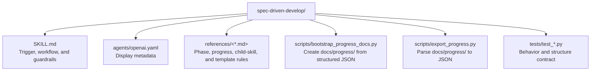

# CLAUDE.md

Breadcrumbs: [Repository Root](../CLAUDE.md) / spec-driven-develop / CLAUDE.md

## Purpose

`spec-driven-develop` turns a large rewrite, migration, or multi-phase transformation request into a preparation workflow with explicit progress tracking. It is useful when the work will span multiple sessions and needs durable planning artifacts before broad implementation starts.

This module is a script-backed example of a planning skill that combines a lean `SKILL.md`, focused references, and deterministic progress-doc helpers.

## Module Map

## Entry Points

Read files in this order:

1. `SKILL.md`
2. `references/workflow-phases.md`
3. `references/progress-tracking.md`
4. `references/sub-skill-generation.md`
5. `references/parallel-execution.md`
6. `references/doc-templates.md`
7. `scripts/bootstrap_progress_docs.py`
8. `scripts/export_progress.py`
9. `tests/test_bootstrap_progress_docs.py`
10. `tests/test_export_progress.py`
11. `tests/test_skill_contract.py`

## Main Interface

The deterministic script surfaces are:

- `python scripts/bootstrap_progress_docs.py --output-root <repo-root> --task-name "<task>" --task-summary "
" --phase-file <phases.json> [--overwrite]`
- `python scripts/export_progress.py <repo-root>/docs/progress [--indent N]`

Primary inputs:

- `--output-root`
- `--task-name`
- `--task-summary`
- `--phase-file`
- `--overwrite`
- `progress_dir`

## Output Contract

This module should produce or describe:

- `docs/progress/MASTER.md`
- `docs/progress/phase-N-<name>.md`
- a child-skill handoff contract that resumes from `MASTER.md`
- structured JSON export of an existing `docs/progress/` tree

## Important Constraints

- This module prepares work; it does not replace repository-specific implementation or verification.
- `docs/progress/MASTER.md` is the cross-session source of truth. Session-local task tools are only mirrors.
- The bootstrap helper expects structured JSON input and should not guess missing phase structure.
- The export helper parses the repository's progress-doc convention; if the Markdown shape drifts, the parser should fail loudly instead of fabricating data.
- Child-skill generation should stay focused on the actual project and phase plan rather than collapsing back into a generic coding skill.

## Related Guides

- Design history: [../docs/superpowers/CLAUDE.md](../docs/superpowers/CLAUDE.md)
- Project skill generation: [../project-skill-builder/CLAUDE.md](../project-skill-builder/CLAUDE.md)
- Repository indexing example: [../codebase-indexing-assistant/CLAUDE.md](../codebase-indexing-assistant/CLAUDE.md)
- Build and verification discovery: [../build-project-fixer/CLAUDE.md](../build-project-fixer/CLAUDE.md)
