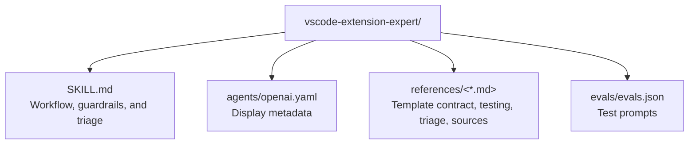

# CLAUDE.md

Breadcrumbs: [Repository Root](../CLAUDE.md) / vscode-extension-expert / CLAUDE.md

## Purpose

`vscode-extension-expert` is a knowledge-backed workflow skill for VS Code extension development using the `vscode-extension-quick-starter` template.

It covers the full lifecycle:
- Extension host code (`extension/`)
- Webview frontend (`webview/`)
- Build tooling (Vite + `@tomjs/vite-plugin-vscode`)
- Test pipeline (Vitest, extension integration tests, Playwright e2e)
- Packaging and release (VSIX via `vsce`)

## Module Map

## Entry Points

Read files in this order:

1. `SKILL.md`
2. `references/template-contract.md`
3. `references/testing-and-release.md`
4. `references/triage-checklist.md`
5. `references/official-sources.md`

## Key Concepts

### Template Contract

The skill is tightly coupled to the `vscode-extension-quick-starter` template. All advice assumes:

- `extension/` for host-side code
- `webview/` for React-based webview UI
- Vite for bundling both sides
- `@tomjs/vite-plugin-vscode` for webview HTML generation and dev-server injection
- `package.json` `main` → `dist/extension/index.js`

### Message Contract

Extension ↔ webview communication is a common source of bugs. The skill emphasizes:

- Stable `type` fields on messages
- Bilateral updates when the contract changes
- Test coverage on both sides

### Validation Layers

Changes must survive:

1. Lint
2. Webview unit tests (Vitest + jsdom)
3. Extension integration tests (`@vscode/test-electron`)
4. E2E tests (Playwright) — when behavior spans host + UI
5. Production build
6. VSIX packaging

## When To Read This Module

Read this module when you need examples of:

- Template-bound skill authoring
- Extension-webview message contract documentation
- Multi-layer test pipeline design (unit → integration → e2e)
- Dev-host launch configuration (`F5` flow)
- VSIX packaging and release workflow

## Related Guides

- Template source of truth: `D:\Project\vscode-extension-quick-starter\CLAUDE.md`
- Design history: [../docs/superpowers/CLAUDE.md](../docs/superpowers/CLAUDE.md)
